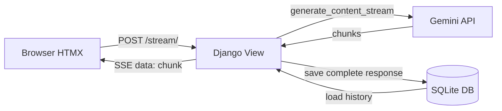

# Django AI Chat Widget

A real-time AI chat application built with Django and Gemini 2.5 Flash.
Responses stream word-by-word using Server-Sent Events — no page reloads.

## Demo


## Features

- Real-time streaming AI responses via SSE
- Persistent chat history stored in SQLite
- HTMX-powered UI — no JavaScript framework needed
- Clear history without page reload
- Secure API key management via environment variables

## Tech Stack

| Layer | Technology |
|-------|-----------|
| Backend | Django 5.x, Python 3.12 |
| AI | Google Gemini 2.5 Flash |
| Frontend | HTMX, vanilla CSS |
| Database | SQLite (swappable to PostgreSQL) |
| Streaming | Server-Sent Events (SSE) |

## Architecture


## Quick Start

## Quick Start

**1. Clone and install**
```bash
git clone https://github.com/Lyte77/ai-chatbot.git
cd ai-chatbot
uv sync
```

**2. Set environment variables**
```bash
cp .env.example .env
# Edit .env and add your GEMINI_API_KEY
```

**3. Run**
```bash
uv run python manage.py migrate
uv run python manage.py runserver
```

Visit `http://127.0.0.1:8000`

Visit `http://127.0.0.1:8000`

## Project Structure
```
├── chat/
│   ├── models.py      # Message model — stores chat history
│   ├── views.py       # Streaming view + history endpoints
│   ├── services.py    # Gemini API integration (isolated from views)
│   └── urls.py
├── templates/
│   └── chat/
│       ├── index.html              # Main chat UI
│       └── partials/
│           └── response.html       # HTMX response fragment
├── config/
│   ├── settings.py
│   └── urls.py
├── .env.example
├── requirements.txt
└── README.md
```

## Key Implementation Details

**Why Server-Sent Events over WebSockets?**
SSE is one-directional (server → client) and works over plain HTTP —
no extra infrastructure needed. WebSockets require a separate protocol
and connection management. For AI streaming, SSE is simpler and sufficient.

**Why a services layer?**
`chat/services.py` isolates all AI logic from Django views. Swapping
Gemini for OpenAI or Anthropic requires changing only this file.

**Async + sync bridge**
Gemini's Python SDK is synchronous. Django's streaming view is async.
An `asyncio.Queue` bridges the two — the sync Gemini thread pushes
chunks into the queue; the async generator pulls and yields them
to the browser immediately.

## What I Learned

- Integrating external LLM APIs into Django applications
- Implementing real-time streaming with SSE and async Django views
- Bridging sync and async Python code safely with asyncio
- HTMX for dynamic UIs without a JavaScript framework
- Separating AI business logic from web framework code

## Roadmap

- [ ] User authentication (per-user chat history)
- [ ] Support for OpenAI and Anthropic as alternative providers
- [ ] Docker deployment configuration
- [ ] Rate limiting per user

## License

MIT